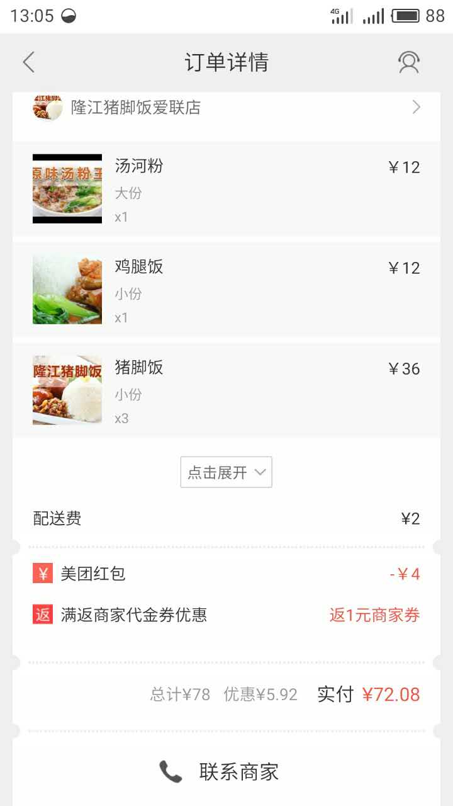
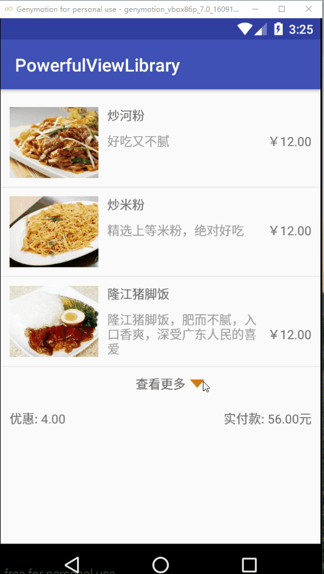
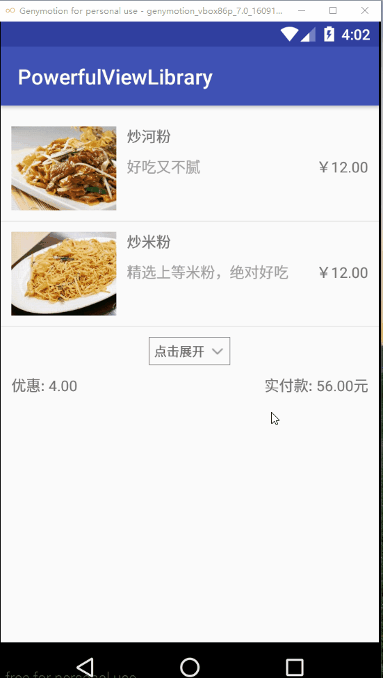

##ExpandableLinearLayout介绍
###场景介绍
&emsp;&emsp;开发的过程中，有时我们需要使用到这样一个功能，在展示一些商品的时候，默认只显示前几个，例如先显示前三个，这样子不会一进入页面就被商品列表占据了大部分，可以先让用户可以看到页面的大概，当用户需要查看更多的商品时，点击“展开”，就可以看到被隐藏的商品，点击“收起”，则又回到一开始的状态，只显示前几个，其他的收起来了。就拿美团外卖的订单详情页的布局作为例子，请看以下图片：

    

&emsp;&emsp;订单详情页面一开始只显示购买的前三样菜，当点击“点击展开”时，则将购买的所有外卖都展示出来，当点击“点击收起”时，则将除了前三样菜以外的都隐藏起来。其实要完成这样的功能并不难，为了方便自己和大家以后的开发，我将其封装成一个控件，取名为ExpandableLinearLayout，下面开始介绍它如何使用以及源码解析。

##使用方式
###一、使用默认展开和收起的底部
在布局文件中，使用ExpandableLinearLayout，代码如下：

    <com.chaychan.viewlib.ExpandableLinearLayout
            android:id="@+id/ell_product"
            android:layout_width="match_parent"
            android:layout_height="wrap_content"
            android:layout_marginTop="10dp"
            android:orientation="vertical"
			app:useDefaultBottom="true"
            app:defaultItemCount="2"
            app:expandText="点击展开"
            app:hideText="点击收起"
            ></com.chaychan.viewlib.ExpandableLinearLayout>

和LinearLayout的使用方法类似，如果是静态数据，可以在两个标签中间插入子条目布局的代码，也可以在java文件中使用代码动态插入。useDefaultBottom是指是否使用默认底部（默认为true，如果需要使用默认底部，可不写这个属性），如果是自定义的底部，则设置为false，下面会介绍自定义底部的用法，defaultItemCount="2",设置默认显示的个数为2，expandText为待展开时的文字提示，hideText为待收起时的文字提示。

在java文件中，根据id找到控件，动态往ExpandableLinearLayout中插入子条目并设置数据即可，代码如下：

    @Bind(R.id.ell_product)
    ExpandableLinearLayout ellProduct;    

      @Override
    protected void onCreate(Bundle savedInstanceState) {
        super.onCreate(savedInstanceState);
        setContentView(R.layout.page_ell_default_bottom_demo);
        ButterKnife.bind(this);

        ellProduct.removeAllViews();//清除所有的子View（避免重新刷新数据时重复添加）
        //添加数据
        for (int i = 0; i < 5; i++) {
            View view = View.inflate(this, R.layout.item_product, null);
            ProductBean productBean = new ProductBean(imgUrls[i], names[i], intros[i], "12.00");
            ViewHolder viewHolder = new ViewHolder(view, productBean);
            viewHolder.refreshUI();
            ellProduct.addItem(view);//添加子条目
        }
    }

     class ViewHolder {
        @Bind(R.id.iv_img)
        ImageView ivImg;
        @Bind(R.id.tv_name)
        TextView tvName;
        @Bind(R.id.tv_intro)
        TextView tvIntro;
        @Bind(R.id.tv_price)
        TextView tvPrice;

        ProductBean productBean;

        public ViewHolder(View view, ProductBean productBean) {
            ButterKnife.bind(this, view);
            this.productBean = productBean;
        }

        private void refreshUI() {
            Glide.with(EllDefaultBottomDemoActivity.this)
                    .load(productBean.getImg())
                    .placeholder(R.mipmap.ic_default)
                    .into(ivImg);
            tvName.setText(productBean.getName());
            tvIntro.setText(productBean.getIntro());
            tvPrice.setText("￥" + productBean.getPrice());
        }
    }

效果如下：

   

####1.支持修改默认显示的个数
可以修改默认显示的个数，比如将其修改为3，即defaultItemCount="3"

效果如下：

####2.支持修改待展开和待收起状态下的文字提示
可以修改待展开状态和待收起状态下的文字提示，比如修改expandText="查看更多"，hideText="收起更多"

效果如下：

####3.支持修改提示文字的大小、颜色

可以修改提示文字的大小和颜色，对应的属性分别是tipTextSize，tipTextColor。比如修改tipTextSize="16sp"，tipTextColor="#ff7300"

效果如下：

####4.支持更换箭头的图标
可以修改箭头的图标，只需配置arrowDownImg属性，引用对应的图标，这里的箭头图标需要是向下的箭头，这样当展开和收起时，箭头会做相应的旋转动画。设置arrowDownImg="@mipmap/arrow\_down\_grey"，修改为灰色的向下图标。

效果如下：

###二、使用自定义底部

布局文件中，ExpandableLinearLayout配置useDefaultBottom="false",声明不使用默认底部。自己定义底部的布局。

    <?xml version="1.0" encoding="utf-8"?>
	<ScrollView
	    xmlns:android="http://schemas.android.com/apk/res/android"
	    xmlns:app="http://schemas.android.com/apk/res-auto"
	    android:layout_width="match_parent"
	    android:layout_height="match_parent"
    >

	    <LinearLayout
	        android:layout_width="match_parent"
	        android:layout_height="match_parent"
	        android:orientation="vertical"
	        >
	
	        <!--商品列表-->
	        <com.chaychan.viewlib.ExpandableLinearLayout
	            android:id="@+id/ell_product"
	            android:layout_width="match_parent"
	            android:layout_height="wrap_content"
	            android:layout_marginTop="10dp"
	            android:orientation="vertical"
	            app:defaultItemCount="2"
	            app:useDefaultBottom="false"
	            >
	
	        </com.chaychan.viewlib.ExpandableLinearLayout>
	
            <!--自定义底部-->
	        <RelativeLayout...>
	          
			<!--优惠、实付款-->
	        <RelativeLayout...>
	
	    </LinearLayout>

    </ScrollView>

java文件中，代码如下：
    
     @Override
    protected void onCreate(Bundle savedInstanceState) {
  		super.onCreate(savedInstanceState);
        setContentView(R.layout.page_ell_custom_bottom_demo);
        ButterKnife.bind(this);

      ...  //插入模拟数据的代码，和上面演示使用默认底部的代码一样
     
      //设置状态改变时的回调
      ellProduct.setOnStateChangeListener(new ExpandableLinearLayout.OnStateChangeListener() {
            @Override
            public void onStateChanged(boolean isExpanded) {
                doArrowAnim(isExpanded);//根据状态箭头旋转
                //根据状态更改文字提示
                if (isExpanded) {
                    //展开
                    tvTip.setText("点击收起");
                } else {
                    tvTip.setText("点击展开");
                }
            }
        });

       //为自定义的底部设置点击事件
       rlBottom.setOnClickListener(new View.OnClickListener() {
            @Override
            public void onClick(View v) {
                ellProduct.toggle();
            }
        });

    }

	  // 箭头的动画
	  private void doArrowAnim(boolean isExpand) {
        if (isExpand) {
            // 当前是展开，箭头由下变为上
            ObjectAnimator.ofFloat(ivArrow, "rotation", 0, 180).start();
        } else {
            // 当前是收起，箭头由上变为下
            ObjectAnimator.ofFloat(ivArrow, "rotation", -180, 0).start();
        }
	 }

主要的代码是为ExpandableLinearLayout设置状态改变的回调，rlBottom为自定义底部的根布局RelativeLayout,为其设置点击事件，当点击的时候调用ExpandableLinearLayout的toggle（）方法，当收到回调时，根据状态旋转箭头以及更改文字提示。

效果如下：

到这里，ExpandableLinearLayout的使用就介绍完毕了，关于ExpandableLinearLayout的源码解析可以查看我的博客：[http://blog.csdn.net/Chay_Chan/article/details/72810770](http://blog.csdn.net/Chay_Chan/article/details/72810770)

####**导入方式**####
在项目根目录下的build.gradle中的allprojects{}中，添加jitpack仓库地址，如下：

    allprojects {
	    repositories {
	        jcenter()
	        maven { url 'https://jitpack.io' }//添加jitpack仓库地址
	    }
	}
 
打开app的module中的build.gradle，在dependencies{}中，添加依赖，如下：

    dependencies {
	       compile 'com.github.chaychan:ExpandableLinearLayout:1.0.0'
	}
